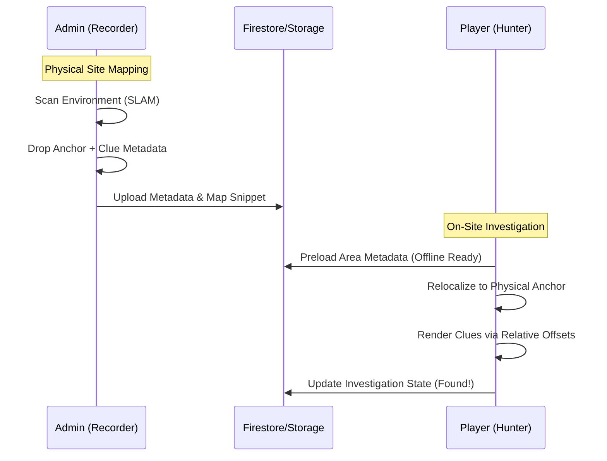

# Architecture: AR Investigation Engine

## System Overview
The AR Investigation Engine (gcr26) is a hybrid system that bridges high-fidelity spatial positioning with a narrative state machine. It follows a **Recorder/Hunter** pattern where physical environments are mapped by game masters and later reconstructed for players.

## Core Architectural Components

### 1. The Recorder (Admin Context)
The Recorder is the authoring tool used by Game Masters to prepare a physical site.
- **Surface Mapping:** Uses ViroReact's Plane Detection to identify floors and walls.
- **Anchor Serialization:** Generates a `SpatialAnchor` (e.g., iOS `ARWorldMap`) that captures the unique visual feature points of the environment.
- **Clue Placement:** Authors place digital objects (bloodstains, footsteps) relative to these anchors.
- **Sync Pipeline:** Metadata (offsets, rotations, IDs) is sent to Firestore, while binary map data and assets are stored in Firebase Storage.

### 2. The Hunter (Player Context)
The Hunter is the runtime engine within the mobile app that executes the investigation.
- **GPS Trigger:** The app monitors proximity to the "Quest Zone" using `expo-location`.
- **Relocalization:** Upon entering the zone and activating "Witcher Senses," the engine attempts to "match" the current camera view against the preloaded `SpatialAnchor` data.
- **Relative Reconstruction:** Once an anchor is found, the engine calculates the global coordinates for clues using the stored relative offsets from that anchor.
- **State Logic:** A linear state machine ensures clues appear sequentially (e.g., Clue B only renders once Clue A has been "Found").

## Data Flow: Spatial Synchronization

## Spatial Hierarchy
- **Quest Zone (GPS):** 50m radius. Guides the player to the site.
- **Spatial Anchor (SLAM):** 5-10m radius. Provides the (0,0,0) coordinate system for AR.
- **Clue (Local):** Precision cm-level placement relative to the Spatial Anchor.

## Offline Preloading Strategy
To support investigations in cellars, forests, and remote areas:
1.  **The "Briefing" Phase:** Before entering the site (while on LTE/Wi-Fi), the app downloads the `Manifest` for the quest.
2.  **Asset Caching:** 3D models and textures are cached via `Expo FileSystem`.
3.  **Local Metadata:** Clue coordinates and narrative text are stored in **MMKV** for zero-latency access.
4.  **Local Relocalization:** The engine performs all feature matching locally using the downloaded `SpatialAnchor` blobs without requiring a round-trip to a cloud anchor service.

## Performance & Optimization
- **Fabric/TurboModules:** Leveraging the React Native "New Architecture" for near-native AR tracking performance.
- **Object Pooling:** Reusing 3D decal meshes for footsteps to prevent memory spikes during long trails.
- **Culling:** Only rendering clues within a specific "Witcher Sense" visibility frustum.

## Technical Boundaries
- **Admin:** React Native (Web/Mobile) + Viro + Firebase Admin.
- **Mobile:** Expo (Custom Dev Build) + Viro + MMKV.
- **Persistence:** Local Binary Blobs (Maps) + Document Metadata (Clues).
