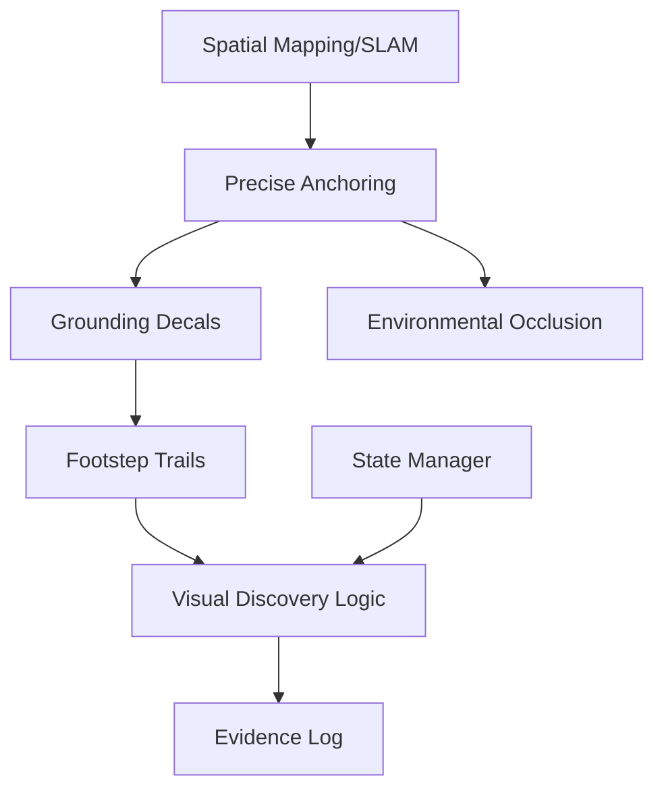

# Feature Landscape: AR Investigation Engine

**Domain:** AR Mobile Gaming / Location-Based Entertainment
**Researched:** October 26, 2023 (Updated for 2026 Context)
**Focus:** "Witcher Sense" mechanics (footsteps, bloodstains, hidden objects)

## Table Stakes
Features users expect from a high-fidelity AR investigation. Missing these makes the "detective" loop feel broken or buggy.

| Feature | Why Expected | Complexity | Notes |
|---------|--------------|------------|-------|
| **Precise Anchoring** | Clues must stay fixed to surfaces (no drifting). | High | Prerequisite for "Investigation" immersion. |
| **Visual Glow/Pulsing** | Highlights interest points (red/gold glow) when in range. | Low | Core "Witcher Sense" visual language. |
| **Proximity Discovery** | Clues only manifest when the player is physically close. | Medium | Prevents "scanning from across the street." |
| **Trail Breadcrumbs** | Visual pathing (footprints, scent clouds) leading to the next clue. | Medium | Connects disconnected investigation sites. |
| **Evidence Log** | A 2D UI list of "found" items and their narrative context. | Low | Players need to review facts outside of the AR view. |
| **Grounding Decals** | Blood/Footprints must align with the floor/wall angle. | Medium | Requires robust plane detection. |

## Differentiators
Features that set this engine apart from generic GPS-based AR games (like *Pokemon GO* or the defunct *Witcher: Monster Slayer*).

| Feature | Value Proposition | Complexity | Notes |
|---------|-------------------|------------|-------|
| **Environmental Occlusion** | Clues can be hidden *behind* or *under* real-world furniture. | High | Leverages SLAM/LiDAR; feels truly "physical." |
| **Perspective Puzzles** | A clue is only readable from a specific physical angle (anamorphic). | High | Forces players to move their body through space. |
| **Multi-Modal Senses** | Switch between "Visual" (tracks), "Scent" (particles), and "EVP" (audio). | Medium | Adds depth to the "Witcher Sense" mechanic. |
| **Lighting Integration** | Digital trails "cast light" or "reflect" on real surfaces. | High | Uses Lighting Estimation for high-fidelity immersion. |
| **Offline Spatial Sync** | Investigation works in cellars/forests without GPS/LTE. | High | Key for "scary" or remote narrative settings. |
| **Diegetic Scanning** | Use the phone as a "UV Light" or "Thermal Scanner" overlay. | Medium | Makes the device feel like a physical tool. |

## Anti-Features
Features to explicitly NOT build for this engine to maintain focus.

| Anti-Feature | Why Avoid | What to Do Instead |
|--------------|-----------|-------------------|
| **Procedural Trails** | Hard to align with real-world obstacles; feels "fake." | Use hand-authored, recorded spatial paths. |
| **Action Combat** | Distracts from the "Detective" core loop. | Use narrative confrontation or "stealth" movement. |
| **Loot/Inventory RPG** | Bloats the UX for a focused investigation experience. | Focus on "Clue" status and narrative unlocks. |
| **Real-time Multiplayer** | Network latency ruins precise AR anchoring/sync. | Use "Asynchronous Persistence" (ghosts/messages). |

## Feature Dependencies

## "Witcher Sense" Expected Behavior
*Based on genre standards and Witcher 3 mechanics.*

1.  **Activation:** A deliberate "focus" mode (e.g., holding a button or raising the phone) that narrows FOV or applies a grayscale filter to the environment while highlighting clues.
2.  **Visual Language:** 
    *   **Footprints:** Subtle red/gold highlights on the floor, slightly glowing.
    *   **Interactions:** Pulsing circles/icons that grow more intense as the camera centers on them.
    *   **Scents:** Floating particle "smoke" trails in the air.
3.  **Auditory Feedback:** Ambient noise should muffle (low-pass filter) while clue-specific sounds (wind, heartbeats, whispers) amplify.
4.  **Narrative Monologue:** Character voice-over or text overlays triggered by clue discovery ("The blood is still wet... they went this way.").

## MVP Recommendation

**Prioritize:**
1. **Precise Anchoring & Plane Detection:** The engine's core value is stability.
2. **Footstep Trail System:** The primary "hunt" mechanic.
3. **Proximity-Based Discovery:** Triggers the "Aha!" moment when finding a hidden object.
4. **Narrative Monologue/Text:** Connects the visual clue to the story state.

**Defer:**
* **Lighting Estimation/Reflections:** Polishing feature for V2.
* **Complex Multi-Modal Senses:** Stick to "Visual" first.
* **Environmental Occlusion:** Start with "on-surface" clues before "behind-surface" clues.

## Sources
- *The Witcher: Monster Slayer* (AR) Post-mortems & Wiki.
- *The Witcher 3* "Witcher Sense" UX Analysis.
- Google ARCore / Apple ARKit Design Guidelines (UX Best Practices).
- Ludvia/gcr26 PROJECT.md.
